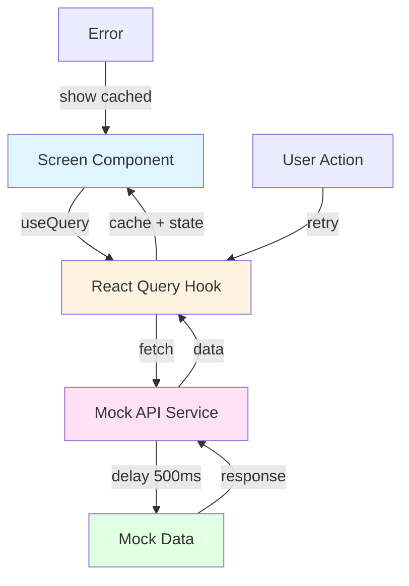

# React Native Category Navigation

A React Native + Expo application featuring a category navigation experience similar to modern e-commerce apps. Built with TypeScript, expo-router, and React Query.

## 🎯 Features

- **Highlight Grid**: 2×2 grid of promotional cards (displayed only when exactly 4 cards are available)
- **Category Navigation**: Multi-level category browsing with support for 2+ levels of depth
- **Brands Section**: Special section for browsing by brand

- **Loading States**: Animated skeleton loaders for all content
- **Error Handling**: Graceful error handling with retry functionality and cached data fallback
- **Stale-While-Revalidate**: Show cached data immediately while revalidating in the background
- **Mock API**: Simulated backend with configurable delay and error scenarios

## 📁 Project Structure

```
category-navigation/
├── app/                      # Screens (expo-router file-based routing)
│   ├── category/
│   │   └── [id].tsx         # Category level screen (dynamic route)
│   ├── _layout.tsx          # Root layout with React Query provider
│   ├── index.tsx            # Main category entry screen
│   ├── products.tsx         # Product list placeholder
│   └── brands.tsx           # Brands placeholder
├── components/              # Reusable UI components
│   ├── BrandRow.tsx
│   ├── CacheIndicator.tsx
│   ├── CategoryItem.tsx
│   ├── CategoryList.tsx
│   ├── ErrorView.tsx
│   ├── HighlightGrid.tsx
│   └── SkeletonLoader.tsx
├── hooks/                   # React Query hooks
│   ├── useCategoryTree.ts
│   └── useHighlightContent.ts
├── services/                # Mock API layer
│   ├── mockApi.ts
│   └── mockData.ts
├── types/                   # TypeScript type definitions
│   └── index.ts
├── utils/                   # Utility functions
│   ├── categoryHelpers.ts
│   └── navigation.ts
├── package.json
└── tsconfig.json
```

## 🏗️ Architecture

### Data Flow



### Component Hierarchy

**CategoryEntryScreen** (Main Screen)

- HighlightGrid (if 4 cards)
  - 4× HighlightCard
- CategoryList
  - N× CategoryItem
- BrandRow

**CategoryLevelScreen** (Nested Categories)
- View All Button
- CategoryList
  - N× CategoryItem

### State Management

- **Server State**: Managed by React Query (`@tanstack/react-query`)
  - Automatic caching with 5-minute stale time
  - Background revalidation
  - Error retry with exponential backoff
- **UI State**: Local component state
- **Navigation State**: Managed by expo-router

## 🔧 Technical Decisions & Trade-offs

### 1. expo-router vs React Navigation Stack
**Decision**: Use expo-router (file-based routing)  
**Rationale**: Already configured in Expo boilerplate, modern standard, better DX  
**Trade-off**: Slightly different API than traditional React Navigation

### 2. React Query vs Redux/Context
**Decision**: Use React Query for server state  
**Rationale**: Built-in caching, stale-while-revalidate, error handling, retry logic  
**Trade-off**: Additional dependency (~50KB), learning curve

### 3. Mock API with Delays
**Decision**: Simulate 500ms network delay  
**Rationale**: Realistic testing of loading states and user experience  
**Trade-off**: Slightly slower development experience

### 4. Component Granularity
**Decision**: Separate presentational components from screen logic  
**Rationale**: Reusability, testability, separation of concerns  
**Trade-off**: More files to manage (but better organization)

### 5. TypeScript Strict Mode
**Decision**: Enable strict TypeScript checking  
**Rationale**: Catch errors at compile time, better IDE support  
**Trade-off**: More verbose code, longer initial development

## 🚀 Setup & Run Instructions

### Prerequisites
- Node.js 18+ 
- npm or yarn
- iOS Simulator (Mac only) or Android Emulator

### Installation

```bash
# Clone the repository
git clone <repository-url>
cd my-app

# Install dependencies
npm install

# Start the development server
npm start
```

### Running on Different Platforms

```bash
# iOS (Mac only)
npm run ios

# Android
npm run android

# Web
npm run web
```

## ✅ Manual Testing Checklist
- [ ] Highlight grid displays with 4 cards
- [ ] Categories load and display correctly
- [ ] Brands row appears at bottom
- [ ] Navigation to category levels works
- [ ] Navigation to product placeholders works
- [ ] Error state shows retry button
- [ ] Cached data displays during errors
- [ ] Skeleton loaders animate smoothly

## ⚠️ Known Limitations
1. **Images**: No image caching optimization (uses placeholder URLs)
2. **Pagination**: No pagination for large category lists
3. **Analytics**: No tracking of user interactions
4. **Deep Linking**: No deep linking support for categories
5. **Accessibility**: Limited accessibility labels and screen reader support
6. **Offline Mode**: No offline-first architecture (relies on React Query cache)
7. **Performance**: No virtualization for long lists

## 🔮 Production Improvements

### High Priority
1. **Image Optimization**: Implement proper image caching with `expo-image`
2. **Virtualization**: Add `FlatList` or `FlashList` for large category lists
3. **Error Boundary**: Implement error boundary for crash handling
4. **Analytics**: Add event tracking (screen views, clicks, searches)
5. **Deep Linking**: Implement deep linking for shareable category URLs

### Medium Priority
6. **Search Functionality**: Implement category search with debouncing
7. **Accessibility**: Add comprehensive accessibility labels and ARIA attributes
8. **Performance Monitoring**: Integrate performance monitoring (Sentry, Firebase)
9. **Automated Tests**: Add unit and E2E tests with Jest and Detox/Maestro
10. **CI/CD**: Set up automated testing and deployment pipeline

### Nice to Have
11. **Animations**: Add page transitions and micro-interactions
12. **Theming**: Implement dark mode support
13. **Localization**: Add multi-language support
14. **Offline Support**: Implement offline-first architecture
15. **Push Notifications**: Add promotional notifications

## 🐛 Debugging

### Enable Error Simulation
To test error handling, modify `services/mockApi.ts`:

```typescript
export const API_CONFIG = {
  simulateError: true,  // Change to true
  delay: 500,
};
```

### Clear React Query Cache
To test fresh data loading:
1. Kill the app completely
2. Clear Metro bundler cache: `npm start -- --reset-cache`
3. Restart the app


